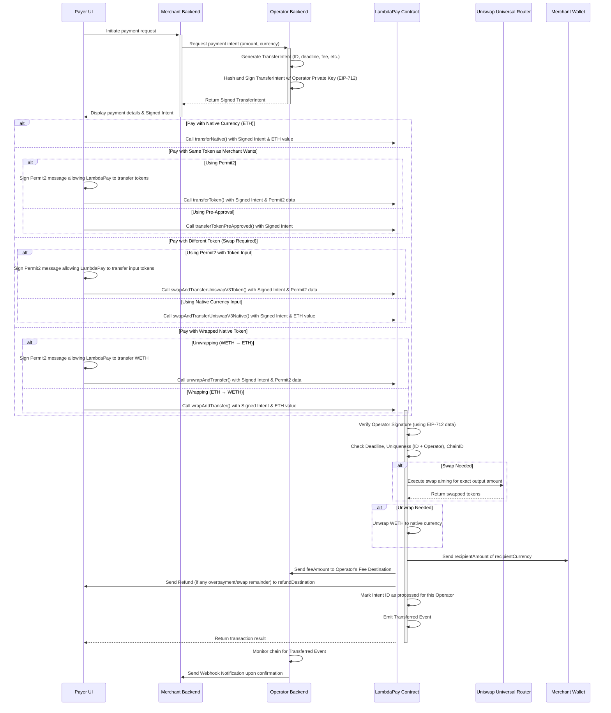

# LambdaPay Protocol (🪜,💰)

[](https://opensource.org/licenses/MIT)
[](https://www.npmjs.com/package/@lambdapay/onchain)
[](https://github.com/lambdapay/onchain/actions)

The LambdaPay Protocol enables seamless and secure cryptocurrency payments between payers and merchants using EVM-compatible blockchains as the settlement layer. It guarantees exact payment amounts for merchants while offering flexibility for payers through optional token swaps and gas optimizations.

---

## Table of Contents

- [Key Benefits ✨](#key-benefits-)
- [How it Works ⚙️](#how-it-works-️)
  - [Core Components](#core-components)
  - [Operators](#operators)
  - [Transfer Intents (`TransferIntent`)](#transfer-intents-transferintent)
  - [Payment Execution Flow](#payment-execution-flow)
- [Protocol Guarantees 📜](#protocol-guarantees-)
- [Contract Payment Methods ➡️](#contract-payment-methods-️)
- [Transaction Outcomes 🔔](#transaction-outcomes-)
  - [Success (`Transferred` Event)](#success-transferred-event)
  - [Failure (Reverts)](#failure-reverts)
- [Integration Guide 🚀](#integration-guide-)
  - [Prerequisites](#prerequisites)
  - [Frontend Integration (Payer Side)](#frontend-integration-payer-side)
- [Security Considerations ⚠️](#security-considerations-️)
- [Deployment 📦](#deployment-)
  - [Directory Structure](#directory-structure)
  - [Prerequisites](#prerequisites-1)
  - [Configuration](#configuration)
  - [Testing Locally](#testing-locally)
  - [Production Deployment](#production-deployment)
  - [Cross-chain Deployment](#cross-chain-deployment)
  - [Contract Size Considerations](#contract-size-considerations)
  - [Deployment Verification](#deployment-verification)
- [License](#license)

---

## Key Benefits ✨

- ✅ **Guaranteed Settlement:** Merchants receive the _exact_ amount requested, eliminating partial or incorrect payments.
- 🔄 **Automatic Conversion:** Payers can use supported tokens (with Uniswap V3 liquidity), automatically converted to the merchant's desired currency. Protects merchants from slippage and volatility during the transaction.
- 🛡️ **Error Prevention:** Operator-signed `TransferIntent`s prevent payments to wrong addresses or with incorrect amounts.
- 🔐 **Secure Signatures:** Leverages EIP-712 typed structured data signatures for enhanced security and user experience in wallets.
- ⛽ **Gas Efficiency (Optional):** Integrates with **Permit2 (0.8.20)** for ERC20 payments, allowing payers gasless token approvals in many scenarios.

---

## How it Works ⚙️

### Core Components

The protocol consists of two primary parts:

1.  **`LambdaPay.sol` Smart Contract:** The on-chain settlement layer deployed to an EVM-compatible blockchain. It verifies intents, handles token transfers/swaps, and ensures atomicity.
2.  **Operator (Off-chain):** A backend service responsible for merchant onboarding, creating and signing `TransferIntent`s, and providing user interfaces. Anyone can deploy and run an Operator.

### Operators

- Operators are backend services that facilitate payments.
- They register their address and an optional separate fee destination address with the `LambdaPay` contract (`registerOperator` / `registerOperatorWithFeeDestination`). This registration is permissionless.
- The Operator generates and signs the `TransferIntent` which authorizes a specific payment.

### Transfer Intents (`TransferIntent`)

- Each payment is defined by a `TransferIntent` struct, created and cryptographically signed _off-chain_ by a registered Operator.
- The Operator's signature guarantees the intent's authenticity and integrity – it cannot be forged or modified by the payer or merchant after signing.
- LambdaPay uses EIP-712 typed structured data signing for better security and wallet user experience.

**`TransferIntent` Contents:**

| Field               | Description                                                                          | Protected By |
| :------------------ | :----------------------------------------------------------------------------------- | :----------- |
| `recipientAmount`   | Exact amount of `recipientCurrency` the merchant must receive                        | Signature    |
| `deadline`          | Unix timestamp after which the payment intent is invalid                             | Signature    |
| `recipient`         | Merchant's wallet address                                                            | Signature    |
| `recipientCurrency` | Token address (or `address(0)` for native currency) the merchant requires            | Signature    |
| `refundDestination` | Address where unused funds (e.g., from swap overestimation) are returned             | Signature    |
| `feeAmount`         | Amount of `recipientCurrency` the Operator will receive as a fee                     | Signature    |
| `id`                | Unique identifier (`bytes16`) for this specific payment intent                       | Signature    |
| `operator`          | Address of the registered Operator facilitating the payment                          | Signature    |
| `signature`         | ECDSA signature from the `operator` over the EIP-712 hash of the intent fields       | N/A          |
| `prefix`            | Optional signature prefix (e.g., `0x1901` for EIP-712, allows EIP-1271 via ERC-6492) | N/A          |

_(**Protected By:** Indicates fields whose integrity is guaranteed by the Operator's `signature`)_

### Payment Execution Flow



---

## Protocol Guarantees 📜

For any transaction executing a valid, signed `TransferIntent`:

- 💯 **Exact Amount:** The `recipient` (merchant) receives exactly `recipientAmount` of `recipientCurrency`.
- 💰 **Operator Fee:** The Operator's `feeDestination` receives exactly `feeAmount` of `recipientCurrency`.
- ⏰ **Deadline Enforcement:** Transactions revert if submitted after the `deadline` (`block.timestamp > deadline`).
- ☝️ **Single Use:** An intent `id` can only be successfully processed once per `operator`. Reverts if attempted again.
- 💸 **Atomicity:** The entire payment (to merchant and operator fee), including any necessary swaps, succeeds or fails together. No partial states are possible.
- 🔄 **Flexible Input:** Payers can initiate payments using native currency or ERC20 tokens. If the input currency differs from `recipientCurrency`, the contract handles the swap via Uniswap V3.
- 🚫 **Output Fee-on-Transfer Resilience:** The contract includes checks (especially for swaps) to mitigate issues where the `recipientCurrency` might have transfer fees, aiming to ensure the merchant and operator receive the net `recipientAmount` and `feeAmount`. Direct transfers (`transferToken*`) assume standard ERC20 behavior for the output token.
- ⛓️ **Chain ID Protection:** EIP-712 signatures inherently include the Chain ID, preventing replay attacks on different chains.

---

## Contract Payment Methods ➡️

The Payer UI must select the appropriate `LambdaPay.sol` function based on the `recipientCurrency` specified in the `TransferIntent` and the currency the payer wishes to use:

| Method                                     | Merchant Wants (`recipientCurrency`) | Payer Pays With (`tokenIn` / `msg.value`) | Token Movement / Action                 | Requires Uniswap Swap? | Payer Approval Needed                         |
| :----------------------------------------- | :----------------------------------- | :---------------------------------------- | :-------------------------------------- | :--------------------- | :-------------------------------------------- |
| `transferNative`                           | Native (e.g., ETH)                   | Native (e.g., ETH)                        | `msg.value` used directly               | No                     | None (implicit via `msg.value`)               |
| `transferToken`                            | ERC20                                | Same ERC20                                | `permit2.transferFrom`                  | No                     | **Permit2** signature for `tokenIn`           |
| `transferTokenPreApproved`                 | ERC20                                | Same ERC20                                | `tokenIn.transferFrom`                  | No                     | Standard `approve` for `tokenIn` to LambdaPay |
| `wrapAndTransfer`                          | WETH                                 | Native (e.g., ETH)                        | `msg.value` -> Wrap to WETH             | No                     | None (implicit via `msg.value`)               |
| `unwrapAndTransfer`                        | Native (e.g., ETH)                   | WETH                                      | `permit2.transferFrom` (WETH) -> Unwrap | No                     | **Permit2** signature for WETH                |
| `unwrapAndTransferPreApproved`             | Native (e.g., ETH)                   | WETH                                      | `WETH.transferFrom` -> Unwrap           | No                     | Standard `approve` for WETH to LambdaPay      |
| `swapAndTransferUniswapV3Native`           | ERC20                                | Native (e.g., ETH)                        | `msg.value` -> Wrap -> Swap             | **Yes**                | None (implicit via `msg.value`)               |
| `swapAndTransferUniswapV3Token`            | Native / ERC20                       | Different ERC20 (`tokenIn`)               | `permit2.transferFrom` -> Swap          | **Yes**                | **Permit2** signature for `tokenIn`           |
| `swapAndTransferUniswapV3TokenPreApproved` | Native / ERC20                       | Different ERC20 (`tokenIn`)               | `tokenIn.transferFrom` -> Swap          | **Yes**                | Standard `approve` for `tokenIn` to LambdaPay |
| `subsidizedTransferToken`                  | ERC20                                | Same ERC20                                | `tokenIn.permit` + `transferFrom`       | No                     | **EIP-2612 `permit`** signature for `tokenIn` |

---

## Transaction Outcomes 🔔

### Success (`Transferred` Event)

Upon successful execution of a payment method, the `LambdaPay` contract emits a `Transferred` event:

```solidity
event Transferred(
    address indexed operator,    // Address of the Operator who signed the intent
    bytes16 indexed id,          // Unique ID of the processed intent
    address indexed recipient,   // Merchant address that received funds
    address sender,              // Payer's address that initiated the transaction
    uint256 spentAmount,         // Amount of input currency spent by the payer
    address spentCurrency,       // Address of input currency (address(0) for native)
    uint256 recipientAmount,     // Amount received by the merchant (guaranteed)
    address recipientCurrency    // Currency received by the merchant
);
```

Off-chain services (like the Operator or Merchant backend) should monitor these events to confirm payments.

### Failure (Reverts)

If any condition is not met, the transaction will revert, preventing any state changes. Common revert reasons include:

- `InvalidSignature`: The provided signature doesn't match the `TransferIntent` and `operator`.
- `ExpiredIntent`: `block.timestamp` is greater than `intent.deadline`.
- `IntentAlreadyProcessed`: The combination of `intent.operator` and `intent.id` has already been used.
- `InvalidOperator`: The `intent.operator` address is not registered.
- `InsufficientBalance` / `TransferFailed`: Payer lacks sufficient funds or token transfer failed.
- `SwapFailedString`: Uniswap V3 swap execution failed (e.g., insufficient liquidity, pool doesn't exist, deadline exceeded).
- Permit2/ERC20 Approval Errors: Insufficient allowance or invalid signature.
- `NonZeroValue`: `msg.value` was sent for a method not expecting native currency.
- `ZeroValue`: `msg.value` was zero for a method expecting native currency input.
- (See `ILambdaPay.sol` and `LambdaPay.sol` for a complete list of custom errors).

---

## Integration Guide 🚀

### Prerequisites

Before integrating LambdaPay, ensure the following components are deployed and accessible on the target blockchain:

- **LambdaPay Contract:** The main contract itself.
- **Uniswap Universal Router:** Required for swap functionalities.
- **Permit2 Contract:** ([Address `0x000000000022D473030F116dDEE9F6B43aC78BA3`](https://etherscan.io/address/0x000000000022D473030F116dDEE9F6B43aC78BA3)) Required for gasless approval methods.
- **Wrapped Native Currency Contract:** (e.g., WETH) Required for swaps involving native currency.
- **Operator Service:** A running instance of an Operator backend, registered with the deployed LambdaPay contract.

### Frontend Integration (Payer Side)

1.  **Receive Intent:** Obtain the Operator-signed `TransferIntent` object (including `intent` data and `signature`) from your application's backend (which likely communicated with the Operator).
2.  **Select Payment Method:** Determine the correct `LambdaPay.sol` function to call based on `intent.recipientCurrency` and the token the payer chooses to pay with (refer to the [Contract Payment Methods](#contract-payment-methods-) table).
3.  **Handle Approvals:**
    - **Permit2 Methods (`transferToken`, `unwrapAndTransfer`, `swapAndTransferUniswapV3Token`):**
      - Prompt the payer to sign a Permit2 message (`PermitTransferFrom` or `PermitBatchTransferFrom`) granting the `LambdaPay` contract address allowance to spend the required input token amount. Libraries like `@uniswap/permit2-sdk` can help construct these messages.
      - Pass the signed Permit2 data along with the `TransferIntent` to the chosen contract method.
    - **Pre-Approved Methods (`*PreApproved`):**
      - Check if the payer has already approved the `LambdaPay` contract to spend sufficient `tokenIn`.
      - If not, prompt the payer to submit a standard ERC20 `approve` transaction.
      - Call the chosen contract method with the `TransferIntent`.
    - **Native Input Methods (`transferNative`, `wrapAndTransfer`, `swapAndTransferUniswapV3Native`):**
      - Ensure the correct amount of native currency (`msg.value`) is sent with the transaction. No separate approval signature is needed.
    - **EIP-2612 Method (`subsidizedTransferToken`):**
      - Check if the `tokenIn` supports EIP-2612 `permit`.
      - Prompt the payer to sign the EIP-2612 `permit` message for the `tokenIn`, granting allowance to the `LambdaPay` contract.
      - Call the method with the `TransferIntent` and the `permit` signature data (`v`, `r`, `s`, `deadline`).
4.  **Construct and Send Transaction:** Call the selected `LambdaPay.sol` function with the `TransferIntent`, necessary approval data (Permit2 or EIP-2612 signature), and `msg.value` if required.
5.  **Handle Results:**
    - **Success:** Listen for the `Transferred` event on the blockchain for definitive confirmation. Update the UI accordingly.
    - **Failure:** Catch potential transaction reverts. Provide informative error messages to the user based on the revert reason.

---

## Security Considerations ⚠️

- **Operator Key Security:** The security of the entire system relies heavily on the Operator keeping their private key secure. A compromised Operator key can sign malicious `TransferIntent`s.
- **Intent Integrity:** The EIP-712 signature prevents tampering with the core payment details (`recipientAmount`, `recipient`, `recipientCurrency`, `deadline`, `feeAmount`, `id`, `operator`).
- **Replay Protection:**
  - The `deadline` prevents executing intents after they expire.
  - The `id` combined with the `operator` address ensures an intent can only be processed once per operator.
  - EIP-712 signatures prevent replay attacks across different chains.
- **Reentrancy:** The contract utilizes the `nonReentrant` modifier from OpenZeppelin to prevent reentrancy attacks during external calls (like swaps or token transfers).
- **Dependency Security:** The security also depends on the correctness and security of integrated contracts like Uniswap Universal Router, Permit2, and the specific ERC20 tokens involved.

---

## Deployment 📦

This section details deploying the `LambdaPay.sol` contract.

### Directory Structure

The `onchain/` directory contains deployment scripts and related files:

```
onchain/
├── script/                  # Solidity deployment scripts (using Foundry)
│   ├── deploy/              # Production deployment scripts
│   │   ├── LambdaPay.s.sol      # Standard deployment
│   │   └── LambdaPayCreate2.s.sol # Deterministic CREATE2 deployment
│   ├── test/                # Test deployment scripts
│   │   ├── TestLambdaPay.s.sol    # Standard test deployment
│   │   └── TestLambdaPayCreate2.s.sol # CREATE2 test deployment
│   ├── mocks/               # Mock contracts for testing deployments
│   │   └── Mocks.sol            # Mock dependencies & CREATE2 factory
│   ├── deploy.sh            # Helper script for production deployments
│   └── test.sh              # Helper script for test deployments
└── README.md                # This file (within onchain/)
```

### Prerequisites

- [Foundry](https://book.getfoundry.sh/getting-started/installation) installed.
- Environment variables configured in `.env.<network>` files (see below).

### Configuration

Create `.env` files for each target network (e.g., `.env.mainnet`, `.env.sepolia`, `.env.polygon`).

**Example `.env.mainnet`:**

```bash
# RPC endpoint for the network
ETH_RPC_URL=https://eth-mainnet.g.alchemy.com/v2/_9jvtNUzoLW1EHR380VZP7GUZaqXvmG3

# Private key of the deployer account (use securely, e.g., via hardware wallet or env manager)
PRIVATE_KEY=0xac0974bec39a17e36ba4a6b4d238ff944bacb478cbed5efcae784d7bf4f2ff80 # Example private key - DO NOT USE

# Deployed addresses of dependencies on the target network
UNISWAP_UNIVERSAL_ROUTER=0x66a9893cC07D91D95644AEDD05D03f95e1dBA8Af # Example Mainnet address
PERMIT2=0x000000000022D473030F116dDEE9F6B43aC78BA3 # Official Permit2 address
WRAPPED_NATIVE=0xC02aaA39b223FE8D0A0e5C4F27eAD9083C756Cc2 # Example WETH Mainnet address

# Optional: Initial operator and fee destination to register during deployment
INITIAL_OPERATOR=0xf39Fd6e51aad88F6F4ce6aB8827279cffFb92266 # Deployer address often used initially
FEE_DESTINATION=0xf39Fd6e51aad88F6F4ce6aB8827279cffFb92266 # Can be same or different

# Optional: Etherscan API Key for verification
ETHERSCAN_API_KEY=YOUR_ETHERSCAN_API_KEY
```

### Testing Locally

Use Anvil (part of Foundry) to simulate deployment locally.

```bash
# Test standard deployment (creates a new address each time)
./script/test.sh standard

# Test CREATE2 deployment (predictable address based on deployer & salt)
# This is the default if no argument is provided
./script/test.sh create2
# or
./script/test.sh
```

These scripts deploy mocks, the LambdaPay contract, and run basic checks.

### Production Deployment

Use the `deploy.sh` script to deploy to live networks.

```bash
# Standard deployment to mainnet (requires .env.mainnet)
./script/deploy.sh mainnet

# Deterministic deployment using CREATE2 to mainnet
./script/deploy.sh mainnet --create2

# Deploy to a different network (e.g., Polygon, requires .env.polygon)
./script/deploy.sh polygon --create2

# Deploy and automatically attempt verification on Etherscan (or similar block explorer)
./script/deploy.sh mainnet --create2 --verify
```

### Cross-chain Deployment

To deploy the LambdaPay contract to multiple chains with the **same address**, you _must_ use the `--create2` deployment option.

1.  Ensure you have correctly configured `.env` files for each target chain (e.g., `.env.mainnet`, `.env.polygon`, `.env.optimism`).
2.  Use the _same_ `PRIVATE_KEY` (deployer address) for all deployments.
3.  The `CREATE2` deployment script uses a fixed salt combined with the deployer address and contract bytecode to generate the address. Ensure constructor parameters (`_permit2`, `_universalRouter`, `_weth`) match the correct addresses _on each respective chain_ within the deployment script if they differ. The _initial_ operator registration parameters (`_initialOperator`, `_feeDestination`) should ideally be consistent if you want the initial state identical, but the address generation _depends only on bytecode and salt_, not constructor _arguments_.

```bash
# Deploy to Ethereum Mainnet using CREATE2
./script/deploy.sh mainnet --create2 --verify

# Deploy to Polygon using CREATE2 (will result in the same address as mainnet)
./script/deploy.sh polygon --create2 --verify

# Deploy to Optimism using CREATE2 (will result in the same address)
./script/deploy.sh optimism --create2 --verify
```

### Contract Size Considerations

The `LambdaPay.sol` contract may exceed the standard 24KB EVM contract size limit. The deployment scripts (`*.s.sol` and `deploy.sh`) are configured to handle this, potentially by using older transaction types or specific compiler settings if needed (though Foundry typically handles optimization well). Be aware of this during deployment and verification.

### Deployment Verification

After deployment:

1.  **Address Confirmation:** Confirm the contract is deployed at the expected address (especially important for `CREATE2`).
2.  **Constructor Arguments:** Verify on a block explorer that the constructor arguments (`permit2`, `universalRouter`, `weth`) were set correctly for the specific network.
3.  **Initial State:** Check if the `initialOperator` and `feeDestination` were registered correctly if provided during deployment.
4.  **Cross-chain Address:** For `CREATE2` deployments, verify the resulting contract address is identical across all deployed chains.

---

## License

This project is licensed under the MIT License. See the [LICENSE](https://opensource.org/licenses/MIT) file for details.
